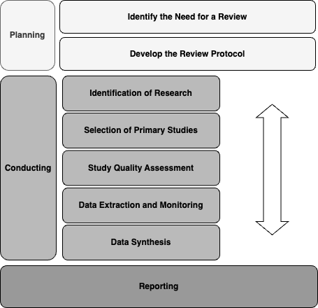
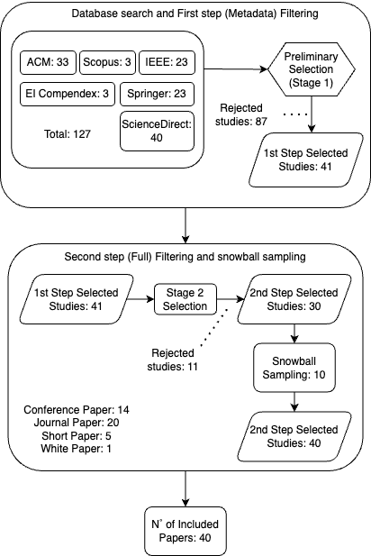
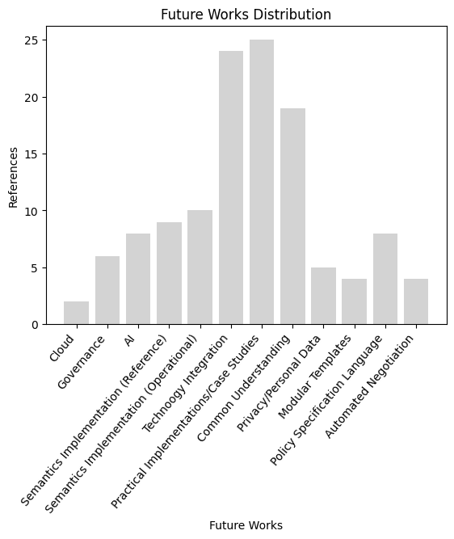

# Towards Legal Interoperability in International Data Spaces: A Systematic Literature Review 


This repository stores all relevant files and data regarding the proposed Systematic Literature Review (SLR). The complete version of the paper describing the lifecycle of such SLR is available in this repository. ([preview](./ESWA_towards_legal_interoperability_SLR.pdf)) | ([download](./ESWA_towards_legal_interoperability_SLR.pdf?raw=true))

## Available Files:
```
.
├── README.md
├── legion_ref_ontology (Reference Ontology)                 # Latest version: v1.0.
├── legion_operational_ontology (Operational Ontology)       # Latest version: v1.1.
├── ISO_dictionary (Glossary of terms, providing ISO reuse)  # Latest version: v1.0.
├── owl_docs (Generated OWL documentation)                   # Latest version: v1.0.
```

## Methodology
To ground our SLR, we employed the guidelines  pointed out by Kitchenham et al. (2004), in which, the authors define an SLR as a means to identify, evaluate, and interpret all available relevant research to a specific domain, topic, area, or particular research. The complete lifecycle is summarized below

</img>

# Review Protocol
The SLR protocol is presented below, and its summary is available [here](./slr_report_summary.pdf).

## Goal
This systematic literature review aims to retrieve the state-of-the-art regarding Legal Interoperability within International Data Spaces (IDS), adhering to the European Interoperability Framework approach, and aligning the IDS architecture and policies.

## Research Questions
* What is Legal Interoperability in IDS?
* What is the conceptual relationship between Data Sovereignty and Legal Interoperability regarding IDS?	
* What is the current representation of legal moments in Data/Usage Policies within IDS and related data ecosystems?
* What are the legal challenges within the IDS domain?
* Are there gaps and opportunities for research and development regarding Legal Aspects in IDS?

## Summary
The complete version of this SLR is available through the paper cited above. The summary of selection is presented below: 

</img>

Finally, as one of the main contributions, we may point out the future works retrieved from the analyzed papers:

</img>

## Outcome

This section provides a short answer for the Research Questions (RQ), we strongly advise to check for the complete version available in section 5 of the paper. 

* RQ1: the semantic capability
of unambiguously representing policies and rules among companies while respecting the so-called state sovereignty. 
* RQ2: refers to the concept of sovereignty over data, i.e., the data provider should
be able to determine who, by how long, and to what end the data consumer may use its data, and
data pricing (with financial, or data exchange ends).
* RQ3: The answer for RQ3 is twofold, the formal approach proposes a set of policy representation
languages, especially ODRL, which is represented in a machine-readable way by the IM itself, even
though, it carries a low detailing power.
* RQ4: the legal challenges of IDS cannot be summarized in a straightforward answer, but
in a set of nuances such as the lack of formal representation for contracts, personal data exchange
and usage, and especially, the absence of an unambiguous domain definition, conditioning the
understanding to subjective matters, such as human interpretation
* RQ5: the main gaps spotted through the SLR were
the development of an unambiguous language model for policies, knowledge representation through
a semantical approach, smart contracts, and usage of AI and Cloud within IDS, with the main
goal of promoting legal interoperability. 

## Conclusion
As one of the steps proposed as methodology in order to develop a framework for enforcing legal interoperability among companies in International Data Spaces, the performed SLR will provided conceptual foundation for further development of such framework. Not only providing gaps, challenges, and opportuinities, but also acting as a foundation for the development of the Legal Interoperability Ontology for International Data Spaces (LegIOn-IDS). We provide the showcase and documentation of such ontology in this [GitHub Repository](https://github.com/VictorBenoiston/legal_interoperability_IDS_ontology).